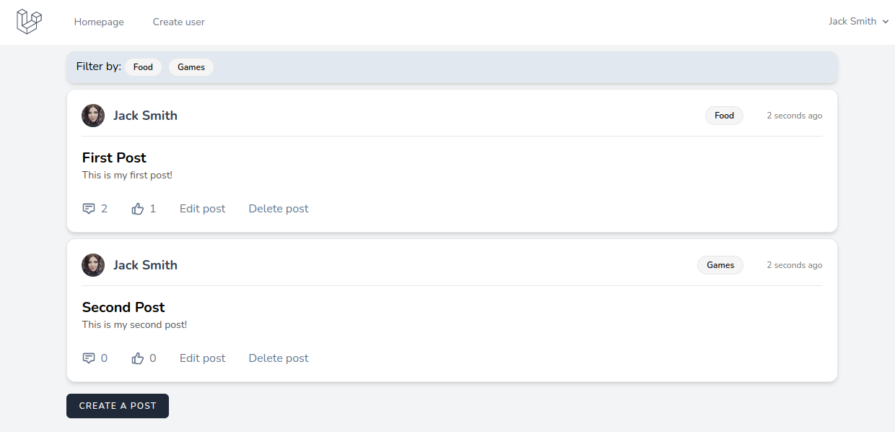

# Laravel forum

This is a little "for-fun" app

Based on:
- Laravel 9
- Tailwind CSS 3
- Vite 3
- Docker 3
- MySQL 8
- Alpine JS
- Laravel Breeze

## Technical Requirements

•   PHP 8.0 or higher <br>
•	Composer installed <br>
•	Docker installed <br>
•	Npm installed <br>

## Installation

You can install this program by executing the following commands:

```bash
git clone https://github.com/MoroAlberto/laravel_forum.git
cd laravel_forum
composer install
npm install
cp .env.example .env
php artisan key:generate
docker-compose up -d
php artisan migrate
php artisan db:seed
npm run dev
php artisan serve
```

After this, go to [localhost](http://127.0.0.1:8000/) to update your forum.

By default I create a user:
```bash
username: test@gmail.com
password: password
```
but the forum is also accessible by those who do not have a login.

## Screenshot

